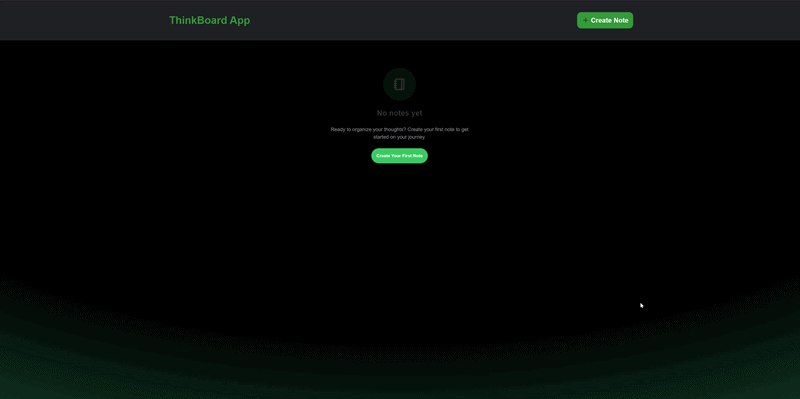

# Welcome to my Thinkboard Notes App!

## Overview
Thinkboard is a fullstack notes application built with React.js, Node.js, Express.js, and MongoDB. It provides real-time note management with a clean, responsive UI and is fully functional across all devices.

## Demo
**

## Tech Stack
- **Frontend:** React.js, HTML5, CSS3 (Flexbox, Grid)
- **Backend:** Node.js, Express.js
- **Database:** MongoDB

## Features
- Create, read, update, and delete notes
- Responsive design for all screen sizes
- Clean and intuitive user interface